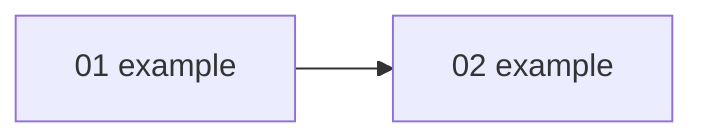

# Module map — <product name>

The spine of the project. Modules ship one at a time, in the order below.

## Modules

| Module | Capability | Owns entities | References entities | Demo-able alone |
|---|---|---|---|---|
| | | | | yes / no |

Every module must be demo-able alone. If it is not, it is a feature of another module.

## Dependency graph



An edge means: the target references an entity the source owns, calls an endpoint it provides,
or consumes an event it emits.

## Cycles broken

| Cycle | Entity extracted to global | Reason |
|---|---|---|

## Cross-cutting concerns

Identified here so they are never left implicit inside one module.

| Concern | Owner: foundation / module / third-party |
|---|---|
| Authentication | |
| Authorization model | |
| Notifications | |
| Audit trail | |
| File upload & storage | |
| Background jobs | |
| Search | |
| Reporting | |

## Build queue

Edit `order` directly to override. The reason column exists so you can disagree with the logic.

```yaml
order:
  - 01-<name>
  - 02-<name>
  - 03-<name>
```

| # | Module | Reason for this position |
|---|---|---|
| 01 | | |
| 02 | | |

## Deferred

Modules explicitly out of this engagement, or parked for a later phase.
